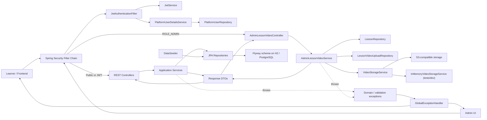
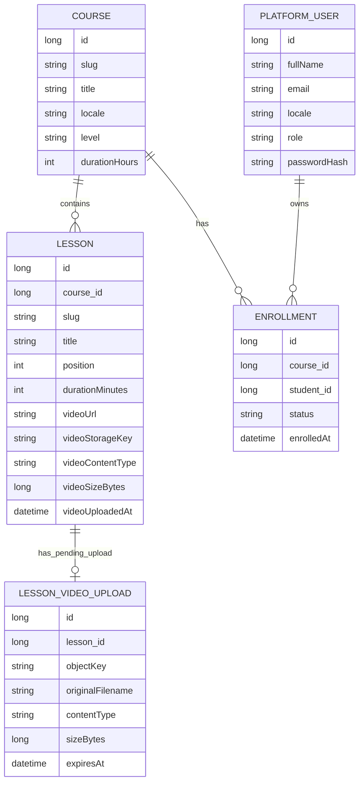

# Project Blueprint: eLearning Backend

## Snapshot

- Repository: `elearning-backend`
- Audit date: `2026-03-21`
- Audit method: code inspection plus repo exploration by a delegated subagent
- Runtime verification status: tests were not re-run from this session because Maven CLI is not installed in this workspace
- Architectural style: layered Spring Boot monolith with JWT auth, Flyway-managed schema, and an admin-only lesson video upload subsystem
- Current default profile: `postgres`
- Canonical schema source: `src/main/resources/db/migration/*.sql`

## The Essence

This repository is a Kazakhstan-focused e-learning backend. It still supports the original learner MVP flow, but it now also includes an admin media-management slice for lesson videos.

Current product shape:

1. learners can browse a seeded course catalog,
2. open a course landing page,
3. enroll anonymously or as an existing user,
4. register or log in with JWT auth,
5. open lesson viewer pages,
6. retrieve the current authenticated user,
7. inspect enrollments with role-based access rules,
8. upload, finalize, or delete lesson videos through admin-only endpoints.

Primary stack:

- Java 17 target
- Spring Boot 3.5.11
- Spring Web
- Spring Data JPA + Hibernate
- Bean Validation
- Spring Security
- JJWT 0.13.0
- Flyway
- H2 support for tests/local scenarios
- PostgreSQL profile configuration
- AWS SDK S3 client/presigner for S3-compatible object storage

This is still not Clean Architecture. It is a pragmatic Spring layered backend where controllers, services, entities, repositories, security, and storage integration live in one deployable application.

## High-Level Architecture

### Architectural Pattern

The codebase follows a classic Spring layered monolith:

- `controller` exposes HTTP endpoints
- `service` contains business rules and DTO assembly
- `repository` handles persistence access
- `entity` models database tables
- `security` wires JWT authentication and principals
- `config` centralizes security, CORS, and media-storage setup
- `service/video` abstracts video storage behind a provider interface
- `exception` centralizes API error translation

### Request/Data Flow

### Domain Model

## API Surface

| Route | Method | Auth | Backing controller/service | Purpose |
| --- | --- | --- | --- | --- |
| `/api/health` | GET | Public | `AppInfoController` | Simple liveness probe |
| `/api/auth/register` | POST | Public | `AuthController` -> `AuthService.register` | Create an account or upgrade a lead-style user shell |
| `/api/auth/login` | POST | Public | `AuthController` -> `AuthService.login` | Return JWT access token |
| `/api/auth/me` | GET | Authenticated | `AuthController` -> `AuthService.me` | Return current principal snapshot |
| `/api/courses` | GET | Public | `CourseController` -> `CourseService.getCatalog` | Course catalog |
| `/api/courses/{slug}` | GET | Public | `CourseController` -> `CourseService.getCourseLanding` | Course landing page |
| `/api/courses/{courseSlug}/lessons/{lessonSlug}` | GET | Public | `CourseController` -> `CourseService.getLessonViewer` | Lesson viewer including `videoUrl` |
| `/api/enrollments` | POST | Public | `EnrollmentController` -> `EnrollmentService.enroll` | Create enrollment |
| `/api/enrollments` | GET | Authenticated | `EnrollmentController` -> `EnrollmentService.getEnrollments` | Students see only their own enrollments; admins can filter across all users |
| `/api/admin/courses/{courseSlug}/lessons/{lessonSlug}/video-upload` | POST | Admin | `AdminLessonVideoController` -> `AdminLessonVideoService.initiateUpload` | Create a pending upload and return upload instructions |
| `/api/admin/courses/{courseSlug}/lessons/{lessonSlug}/video-upload/complete` | POST | Admin | `AdminLessonVideoController` -> `AdminLessonVideoService.completeUpload` | Verify stored object and attach it to the lesson |
| `/api/admin/courses/{courseSlug}/lessons/{lessonSlug}/video` | DELETE | Admin | `AdminLessonVideoController` -> `AdminLessonVideoService.deleteVideo` | Remove lesson video metadata and best-effort delete the object |
| `/h2-console` | GET/UI | Public only when `local` enables it | Spring H2 console | Local DB inspection only |

## High-Signal File Map

### Build, Bootstrap, and Config

| Path | Responsibility | Why it matters |
| --- | --- | --- |
| `pom.xml` | Maven build descriptor | Declares Spring Boot, Flyway, Security, JWT, PostgreSQL, H2, and AWS S3 dependencies |
| `src/main/java/kz/skills/elearning/ElearningBackendApplication.java` | Spring Boot entry point | Single-module app bootstrap |
| `src/main/java/kz/skills/elearning/config/SecurityConfig.java` | Route authorization and stateless auth wiring | Defines public routes, authenticated routes, and `/api/admin/**` role requirements |
| `src/main/java/kz/skills/elearning/config/WebConfig.java` | CORS config | Allows configured frontend origins on `/api/**` |
| `src/main/java/kz/skills/elearning/config/VideoStorageConfig.java` | S3 client/presigner bean wiring | Enables S3-compatible uploads when provider is `s3` |
| `src/main/java/kz/skills/elearning/config/VideoStorageProperties.java` | Typed media-storage config | Governs provider, bucket, endpoint, content types, file-size cap, and presign duration |
| `src/main/resources/application.yml` | Shared runtime config | Sets port `7777`, default profile `postgres`, base datasource, CORS, JWT expiration, and video settings |
| `src/main/resources/application-local.yml` | Local-only config | Enables H2 console and a local JWT secret fallback |
| `src/main/resources/application-prod.yml` | Production profile overrides | Disables H2 console and expects `APP_SECURITY_JWT_SECRET` |
| `src/main/resources/application-postgres.yml` | PostgreSQL profile config | Supplies PostgreSQL datasource settings and a postgres-profile JWT secret fallback |

### Core Learner Flow

| Path | Responsibility | Why it matters |
| --- | --- | --- |
| `src/main/java/kz/skills/elearning/controller/AuthController.java` | Register, login, current-user endpoints | Entry point for auth lifecycle |
| `src/main/java/kz/skills/elearning/controller/CourseController.java` | Public catalog, course, and lesson endpoints | Read APIs used by the learner-facing frontend |
| `src/main/java/kz/skills/elearning/controller/EnrollmentController.java` | Enrollment create/list endpoints | Public enrollment plus authenticated reporting |
| `src/main/java/kz/skills/elearning/service/AuthService.java` | Registration/login/current-user rules | Upgrades pre-existing lead users and issues JWTs |
| `src/main/java/kz/skills/elearning/service/CourseService.java` | Catalog and lesson DTO assembly | Keeps learner read APIs stable even as `Lesson` evolves |
| `src/main/java/kz/skills/elearning/service/EnrollmentService.java` | Enrollment creation and visibility rules | Handles duplicate prevention, role rules, and lead-shell behavior |
| `src/main/java/kz/skills/elearning/service/DataSeeder.java` | Demo data bootstrap | Seeds `digital-skills-kz` and two lessons when the DB is empty |

### Video Upload Subsystem

| Path | Responsibility | Why it matters |
| --- | --- | --- |
| `src/main/java/kz/skills/elearning/controller/AdminLessonVideoController.java` | Admin media endpoints | Entry point for upload-init, upload-complete, and delete |
| `src/main/java/kz/skills/elearning/service/AdminLessonVideoService.java` | Video upload orchestration | Validates requests, persists pending uploads, verifies stored objects, updates lessons, deletes prior objects |
| `src/main/java/kz/skills/elearning/service/video/VideoStorageService.java` | Storage abstraction | Decouples lesson media flow from concrete storage |
| `src/main/java/kz/skills/elearning/service/video/S3VideoStorageService.java` | S3-compatible implementation | Generates presigned PUT URLs and resolves playback URLs |
| `src/main/java/kz/skills/elearning/service/video/InMemoryVideoStorageService.java` | In-memory implementation | Used by tests and useful for non-S3 scenarios |
| `src/main/java/kz/skills/elearning/entity/LessonVideoUpload.java` | Pending upload persistence model | Tracks a single active pending upload per lesson |
| `src/main/java/kz/skills/elearning/repository/LessonVideoUploadRepository.java` | Pending upload repository | Supports lookup and cleanup by lesson/object key |

### Persistence and Security Foundations

| Path | Responsibility | Why it matters |
| --- | --- | --- |
| `src/main/java/kz/skills/elearning/entity/Course.java` | Course aggregate root | Owns lessons and enrollment relationships |
| `src/main/java/kz/skills/elearning/entity/Lesson.java` | Lesson model | Now carries learner-facing `videoUrl` plus storage metadata |
| `src/main/java/kz/skills/elearning/entity/PlatformUser.java` | User record | Represents both pre-registration leads and fully registered accounts |
| `src/main/java/kz/skills/elearning/entity/Enrollment.java` | Course membership record | Persists learner/course relationship |
| `src/main/java/kz/skills/elearning/security/JwtAuthenticationFilter.java` | JWT-to-principal bridge | Populates Spring Security context |
| `src/main/java/kz/skills/elearning/security/JwtService.java` | Token generation/validation | Central source for token expiry behavior |
| `src/main/java/kz/skills/elearning/exception/GlobalExceptionHandler.java` | Error envelope mapping | Keeps API errors consistent across auth, validation, domain, and upload failures |
| `src/main/resources/db/migration/V1__init_schema.sql` | Baseline schema | Creates core course/lesson/user/enrollment tables |
| `src/main/resources/db/migration/V2__add_lesson_video_uploads.sql` | Media schema evolution | Adds lesson video metadata and `lesson_video_uploads` |

### Tests and Docs

| Path | Responsibility | Why it matters |
| --- | --- | --- |
| `src/test/java/kz/skills/elearning/ApiIntegrationTests.java` | Main behavior regression suite | Covers auth, enrollment visibility, and admin video upload workflow |
| `src/test/java/kz/skills/elearning/InMemoryVideoStorageServiceTests.java` | Storage unit test | Verifies the in-memory provider contract |
| `src/test/java/kz/skills/elearning/PostgresProfileStartupTests.java` | Profile smoke test | Confirms `prod` activates the `postgres` profile group cleanly |
| `src/test/java/kz/skills/elearning/ElearningBackendApplicationTests.java` | Context smoke test | Confirms app startup under test overrides |
| `README.md` | Human-readable project intro | Currently lags behind the codebase in a few important areas |
| `docs/demo-commands.sh` | Demo script | Still shows only the learner flow |
| `docs/mvp-schema.sql` | Legacy schema doc | No longer reflects the media-upload schema and should not be treated as canonical |

## Core Business Logic Explained

### 1. Anonymous enrollment and later registration share one user row

This remains the most important design shortcut in the app.

- `EnrollmentService` finds or creates a `PlatformUser` by normalized email.
- A user created from enrollment may have no `passwordHash`.
- `AuthService.register` upgrades that same record later if the email already exists without a password.
- `AuthService.login` rejects passwordless shells and tells the caller to register first.

Why this exists:

- preserves enrollments created before registration,
- avoids duplicate people records,
- keeps the signup funnel low-friction,
- avoids a separate lead table.

Tradeoff:

- `PlatformUser` mixes lead-style and fully authenticated lifecycles in one table.

### 2. Lesson video upload is a two-step admin workflow

The new media subsystem works like this:

1. `initiateUpload` validates content type and max size, builds an object key, deletes any previous pending row for the lesson, stores a new `LessonVideoUpload`, and returns upload instructions.
2. The client uploads directly to the storage provider.
3. `completeUpload` reloads the pending row, checks expiry, verifies the uploaded object metadata, writes lesson video metadata back to `Lesson`, clears the pending row, and best-effort deletes any previously attached object.
4. `deleteVideo` clears lesson video metadata and best-effort deletes the stored object.

Important implication:

- the learner-facing lesson route did not change shape; the media subsystem updates `Lesson.videoUrl`, and `CourseService` simply returns that value.

### 3. Role boundaries are simple but real

- Public: health, catalog, course detail, lesson viewer, register, login, and enrollment creation
- Authenticated: `/api/auth/me`, enrollment listing
- Admin only: `/api/admin/**`

Students can only list their own enrollments. Admins can filter enrollments by `courseSlug`, `email`, or both.

### 4. DTO assembly still happens in services

The services both execute business rules and construct response DTOs. That keeps the codebase small and easy to extend quickly, but it also couples service methods to the API contract.

## Infrastructure and Environment

### Profiles and Database

Current config truth:

- `application.yml` sets `spring.profiles.default: postgres`
- `application.yml` also groups `prod -> postgres`
- base datasource values in `application.yml` still point at H2
- `application-postgres.yml` overlays PostgreSQL datasource settings
- `application-local.yml` enables the H2 console and a local JWT secret fallback
- Hibernate runs with `ddl-auto: validate`
- Flyway owns schema creation and evolution

Practical takeaway:

- the repo is no longer best described as "local profile by default"
- local H2 console support still exists, but only when `local` is active
- the real schema source of truth is the Flyway migration folder, not `docs/mvp-schema.sql`

### Video Storage

Default media config in `application.yml`:

- provider: `s3`
- bucket: `elearning-videos`
- endpoint: `http://localhost:9000`
- public base URL: `http://localhost:9000/elearning-videos`
- region: `us-east-1`
- lesson prefix: `lessons`
- max file size: `536870912` bytes
- allowed content types: `video/mp4`, `video/webm`
- presign duration: `15m`
- path-style access: enabled

Interpretation:

- the code is written for S3-compatible storage, including MinIO-style local setups
- tests switch the provider to `in-memory` so they do not depend on real object storage

### Security

- Stateless JWT auth
- BCrypt password hashing
- `ApiErrorResponse` is used for application-generated errors
- `SecurityConfig` also returns a matching JSON envelope for unauthenticated `401` responses
- `@EnableMethodSecurity` is enabled, though the main authorization rules are still URL-based

### Tooling and Delivery

No CI/CD or containerization files were found:

- no `.github/workflows`
- no Dockerfile
- no Docker Compose
- no Maven wrapper script

Implication:

- the app is easy to read and run in a configured IDE,
- but repeatable CLI/bootstrap workflows are weaker than the code itself.

## Current State Verified From Source

The following items are directly supported by the current codebase:

- package layout is `config`, `controller`, `dto`, `entity`, `exception`, `repository`, `security`, `service`, and `service/video`
- the seeded course remains `digital-skills-kz`
- the seed data includes two lessons
- seeded lessons still start with example `videoUrl` values even before admin-managed uploads happen
- lesson viewer responses include `videoUrl`
- admin media endpoints are present and guarded by `ROLE_ADMIN`
- the codebase currently contains 15 tests:
  - 12 integration tests in `ApiIntegrationTests`
  - 1 unit test for `InMemoryVideoStorageService`
  - 1 postgres-profile startup test
  - 1 context load smoke test
- tests use `app.media.video.provider=in-memory` when exercising upload behavior
- no in-repo Codex `SKILL.md` or automation files were found

The following claims were not re-executed from this session:

- `mvn test` status
- full app startup against a real PostgreSQL instance
- live S3/MinIO upload behavior

## Documentation Drift and Risk Areas

### Documentation drift that should be assumed until checked

- `README.md` still describes the project largely as the older learner MVP
- `README.md` says the default profile is `local`, but config now says `postgres`
- `docs/demo-commands.sh` does not include the admin video upload flow
- `docs/mvp-schema.sql` does not include the `V2` lesson video upload schema

### Notable technical risks

1. Default profile surprise
   The default profile is `postgres`, which materially changes startup expectations compared with the older docs.

2. Sensitive config defaults are still present in profile files
   `application-postgres.yml` includes fallback PostgreSQL and JWT values, so secret externalization is not as strict as earlier documentation implied.

3. Pending upload cleanup is request-driven, not scheduled
   Expired pending rows are cleaned during completion attempts, but there is no background cleanup process.

4. Upload verification is metadata-based
   The completion flow checks content type and size, but it does not do deeper media validation, checksums, transcoding, or virus scanning.

5. Delivery automation is thin
   There is still no CI pipeline, container story, or checked-in local bootstrap wrapper.

## Recommended Next Engineering Steps

1. Update `README.md`, `docs/demo-commands.sh`, and `docs/mvp-schema.sql` so they stop disagreeing with the Java/YAML/Flyway source of truth.
2. Decide whether the intended default runtime should really be `postgres`; if not, move back to `local` as the default profile.
3. Remove committed fallback secrets/credentials from non-local profile files and document required env vars explicitly.
4. Add an integration smoke path for real S3-compatible storage, or at least a documented MinIO developer flow.
5. Add cleanup/expiry handling for stale `lesson_video_uploads` rows.
6. If media workflows keep growing, split lesson-content/media concerns into a clearer bounded module.

## Short Instruction For Future AI Developers

Use the Java code, YAML config, Flyway migrations, and tests as the source of truth. Treat older docs as helpful but fallible.

Before changing behavior:

1. check `SecurityConfig` for route visibility and admin boundaries,
2. check `application.yml` plus active profile overlays before assuming startup behavior,
3. check Flyway migrations instead of `docs/mvp-schema.sql` for schema truth,
4. check `EnrollmentService` and `AuthService` before changing user/account lifecycle behavior,
5. check `AdminLessonVideoService`, `Lesson`, and `VideoStorageService` before touching lesson media behavior,
6. update tests and companion docs together when changing public contracts.

If you only remember one mental model, remember this:

- this is a layered Spring Boot backend,
- learner APIs are still the stable public face,
- admin media upload is now a first-class subsystem,
- the current truth is in code and migrations, not in the older docs.
