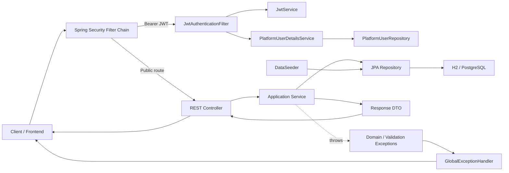
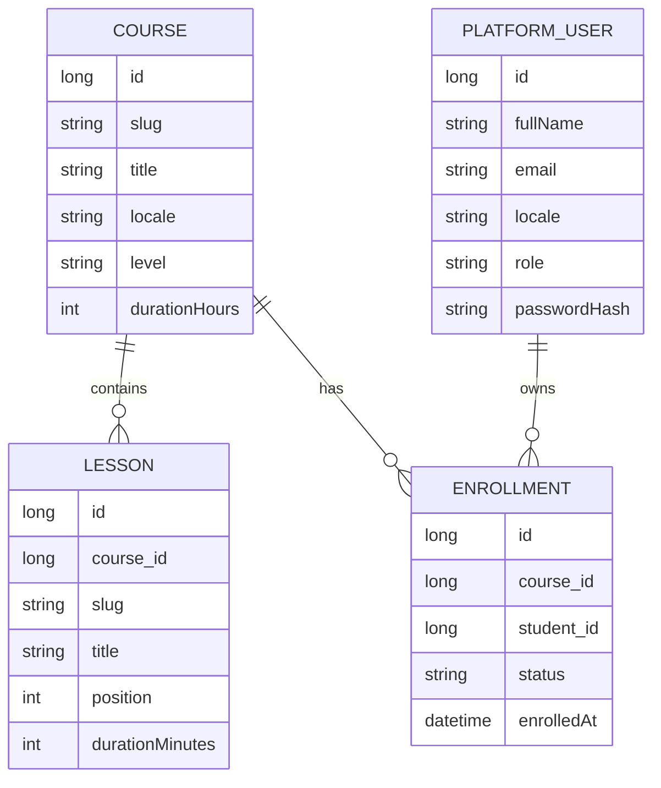

# Project Blueprint: eLearning Backend MVP

## Snapshot

- Repository: `elearning-backend`
- Audit date: `2026-03-14`
- Runtime status: `mvn test` passes with 6 tests; Spring context starts successfully with H2
- Architectural style: layered monolith with REST controllers, service layer, Spring Data JPA repositories, and JWT-based stateless security

## The Essence

This MVP is a backend for a Kazakhstan-focused e-learning platform. Its current purpose is to support a minimal learner journey:

1. browse a seeded course catalog,
2. open a course landing page,
3. enroll into a course,
4. register/login for an account,
5. open a lesson viewer,
6. retrieve the current authenticated user,
7. inspect saved enrollments if authenticated.

Primary stack:

- Java 17 target, tested on Java 21
- Spring Boot 3.5.11
- Spring Web
- Spring Data JPA + Hibernate
- Spring Security
- JJWT 0.13.0
- H2 in-memory DB by default
- PostgreSQL profile for later persistence

This is not Clean Architecture. It is a pragmatic Spring Boot layered MVP where domain entities, persistence, and application logic remain close together for speed of delivery.

## High-Level Architecture

### Architectural Pattern

The codebase follows a classic Spring layered monolith:

- `controller` exposes HTTP endpoints
- `service` contains business rules and DTO mapping
- `repository` abstracts persistence
- `entity` models database state
- `security` handles authentication and principal resolution
- `exception` centralizes API error mapping

### Request/Data Flow

### Domain Model

## Component Interaction

### Dependency Structure

- `AuthController` -> `AuthService` -> `PlatformUserRepository`, `AuthenticationManager`, `JwtService`
- `CourseController` -> `CourseService` -> `CourseRepository`, `LessonRepository`
- `EnrollmentController` -> `EnrollmentService` -> `EnrollmentRepository`, `CourseRepository`, `PlatformUserRepository`
- `SecurityConfig` -> `JwtAuthenticationFilter`
- `JwtAuthenticationFilter` -> `JwtService`, `PlatformUserDetailsService`
- `PlatformUserDetailsService` -> `PlatformUserRepository`
- `GlobalExceptionHandler` maps service/controller exceptions into HTTP JSON errors
- `DataSeeder` bootstraps demo data through `CourseRepository`

### Behavioral Notes

- Catalog and lesson-read routes are public.
- Registration and login are public.
- Enrollment creation is public.
- Enrollment listing is authenticated, even though older documentation presents it like a public demo endpoint.
- JWT authentication is stateless; no server-side session storage exists.
- Services return DTOs directly; controllers are thin.
- Persistence is entity-driven; there is no separate domain model or mapping layer.

## API Surface

| Route | Method | Auth | Backing controller/service | Purpose |
| --- | --- | --- | --- | --- |
| `/api/health` | GET | Public | `AppInfoController` | Simple liveness probe |
| `/api/auth/register` | POST | Public | `AuthController` -> `AuthService.register` | Create account or upgrade pre-existing lead user |
| `/api/auth/login` | POST | Public | `AuthController` -> `AuthService.login` | Return JWT |
| `/api/auth/me` | GET | Authenticated | `AuthController` -> `AuthService.me` | Return current principal snapshot |
| `/api/courses` | GET | Public | `CourseController` -> `CourseService.getCatalog` | Course catalog |
| `/api/courses/{slug}` | GET | Public | `CourseController` -> `CourseService.getCourseLanding` | Course landing page |
| `/api/courses/{courseSlug}/lessons/{lessonSlug}` | GET | Public | `CourseController` -> `CourseService.getLessonViewer` | Lesson viewer |
| `/api/enrollments` | POST | Public | `EnrollmentController` -> `EnrollmentService.enroll` | Create enrollment |
| `/api/enrollments` | GET | Authenticated | `EnrollmentController` -> `EnrollmentService.getEnrollments` | Students can list only their own enrollments; admins can filter across all users |
| `/h2-console` | GET/UI | Public | Spring Boot H2 console | Local DB inspection |

## File-by-File / Module-by-Module Breakdown

### Root and Docs

| Path | Responsibility | Key logic | Why it exists in this form |
| --- | --- | --- | --- |
| `pom.xml` | Maven build descriptor | Declares Spring Boot starters, H2, PostgreSQL, Security, JWT libraries | Minimal dependency set for a demoable monolith without extra plugins or modules |
| `README.md` | Human-readable project intro | Lists routes, auth flow, runtime port, and demo behavior | Aligned with the current backend behavior after the audit fixes |
| `docs/demo-commands.sh` | Manual demo script | `curl` requests for catalog, enroll, register, lesson, authenticated enrollment list | Quick smoke-demo helper for a human presenter |
| `docs/mvp-schema.sql` | Draft schema documentation | SQL tables for core course/enrollment/auth model | Lightweight schema reference that now matches the current entity model more closely |

### Bootstrap and Config

| Path | Responsibility | Key logic | Why implemented this way |
| --- | --- | --- | --- |
| `src/main/java/kz/skills/elearning/ElearningBackendApplication.java` | Spring Boot entry point | `SpringApplication.run(...)` | Standard single-module bootstrapping |
| `src/main/java/kz/skills/elearning/config/SecurityConfig.java` | HTTP security rules | Stateless session policy, route authorization, JWT filter registration, password encoder, `AuthenticationManager` bean, consistent `401` JSON payload | Keeps all security wiring centralized and explicit |
| `src/main/java/kz/skills/elearning/config/WebConfig.java` | CORS setup | Allows configured local frontend origins on `/api/**` | Lightweight frontend enablement for local MVP integration |
| `src/main/resources/application.yml` | Default runtime config | H2 datasource, Hibernate auto-update, H2 console, server port `7777`, JWT secret, CORS | Optimized for local startup with zero external infra |
| `src/main/resources/application-postgres.yml` | Alternate DB profile | PostgreSQL datasource via env vars | Simple path to move from in-memory demo DB to persistent DB |

### Controllers

| Path | Responsibility | Key methods | Why implemented this way |
| --- | --- | --- | --- |
| `src/main/java/kz/skills/elearning/controller/AppInfoController.java` | Health endpoint | `health()` returns a small map | Avoids pulling in Spring Actuator for a very small MVP |
| `src/main/java/kz/skills/elearning/controller/AuthController.java` | Auth API | `register`, `login`, `me` | Keeps controller thin and delegates all policy to `AuthService` |
| `src/main/java/kz/skills/elearning/controller/CourseController.java` | Public read APIs for learning content | `getCatalog`, `getCourseLanding`, `getLesson` | Groups learner-facing course read endpoints in one controller |
| `src/main/java/kz/skills/elearning/controller/EnrollmentController.java` | Enrollment API | `enroll`, `getEnrollments` | Separates enrollment flow from course content flow |

### Services

| Path | Responsibility | Key methods | Why implemented this way |
| --- | --- | --- | --- |
| `src/main/java/kz/skills/elearning/service/AuthService.java` | Registration, login, current-user projection | `register`, `login`, `me`, normalization helpers | Centralizes auth-specific user lifecycle and JWT issuance |
| `src/main/java/kz/skills/elearning/service/CourseService.java` | Catalog and lesson read model assembly | `getCatalog`, `getCourseLanding`, `getLessonViewer`, `toLessonOutline` | Converts entities into frontend-ready DTOs in one place |
| `src/main/java/kz/skills/elearning/service/EnrollmentService.java` | Enrollment creation and listing | `enroll`, `getEnrollments`, admin/student visibility rules, `createStudent`, `toResponse` | Holds the main business rules for enrollment, deduplication, and privacy |
| `src/main/java/kz/skills/elearning/service/DataSeeder.java` | Demo data bootstrap | `run(...)` seeds one course and two lessons if DB is empty | Guarantees an immediately usable demo environment |

### Security

| Path | Responsibility | Key methods | Why implemented this way |
| --- | --- | --- | --- |
| `src/main/java/kz/skills/elearning/security/JwtAuthenticationFilter.java` | Resolves `Bearer` token into authenticated principal | `doFilterInternal` | Standard stateless JWT bridge into Spring Security context |
| `src/main/java/kz/skills/elearning/security/JwtService.java` | JWT creation and validation | `generateToken`, `extractSubject`, `isTokenValid`, `getExpirationSeconds` | Isolates token format and crypto handling from service/controller logic; now reads a proper duration-based config |
| `src/main/java/kz/skills/elearning/security/PlatformUserDetailsService.java` | Spring Security user lookup | `loadUserByUsername` | Lets `AuthenticationManager` authenticate against persisted users |
| `src/main/java/kz/skills/elearning/security/PlatformUserPrincipal.java` | Authenticated principal model | `from`, `getAuthorities`, `getUsername`, `getPassword` | Adapts `PlatformUser` into Spring Security's `UserDetails` contract |

### Repositories

| Path | Responsibility | Key methods | Why implemented this way |
| --- | --- | --- | --- |
| `src/main/java/kz/skills/elearning/repository/CourseRepository.java` | Course persistence access | `findAllByOrderByCreatedAtDesc`, `findBySlug` | Uses derived queries; `findBySlug` preloads lessons via `@EntityGraph` |
| `src/main/java/kz/skills/elearning/repository/EnrollmentRepository.java` | Enrollment persistence access | `existsByCourse_IdAndStudent_Id`, `findAllByOrderByEnrolledAtDesc`, filtered finders | Encodes common list/filter use cases directly in repository method names |
| `src/main/java/kz/skills/elearning/repository/LessonRepository.java` | Lesson lookup | `findByCourse_SlugAndSlug`, `findByCourse_SlugOrderByPositionAsc` | Efficient lesson resolution by slugs; one method remains unused in current code |
| `src/main/java/kz/skills/elearning/repository/PlatformUserRepository.java` | User lookup | `findByEmailIgnoreCase` | Email is the single identity key in the MVP |

### Entities

| Path | Responsibility | Key fields / behavior | Why implemented this way |
| --- | --- | --- | --- |
| `src/main/java/kz/skills/elearning/entity/BaseEntity.java` | Shared audit timestamps | `createdAt`, `updatedAt`, `@PrePersist`, `@PreUpdate` | Removes repeated timestamp code across all entities and normalizes persistence timestamps to UTC |
| `src/main/java/kz/skills/elearning/entity/Course.java` | Course aggregate root for content | Metadata + `lessons` + `enrollments`, `addLesson(...)` | Makes seeded course creation and cascade save simple |
| `src/main/java/kz/skills/elearning/entity/Lesson.java` | Course lesson | `course`, `slug`, `content`, `position`, media metadata | Minimal content model that still supports a lesson viewer |
| `src/main/java/kz/skills/elearning/entity/PlatformUser.java` | Learner/account record | `email`, `fullName`, `locale`, `role`, `passwordHash`, enrollments | Single table currently acts as both lead capture and authenticated account |
| `src/main/java/kz/skills/elearning/entity/Enrollment.java` | Join entity between user and course | `course`, `student`, `status`, `enrolledAt` | Tracks course membership independently from account details |
| `src/main/java/kz/skills/elearning/entity/EnrollmentStatus.java` | Enrollment lifecycle enum | `ENROLLED`, `COMPLETED`, `CANCELLED` | Allows simple future evolution without adding another table |
| `src/main/java/kz/skills/elearning/entity/UserRole.java` | User authorization enum | `STUDENT`, `ADMIN` | Prepares for RBAC without implementing admin tooling yet |

### DTOs

| Path | Responsibility | Key structure | Why implemented this way |
| --- | --- | --- | --- |
| `src/main/java/kz/skills/elearning/dto/ApiErrorResponse.java` | Standard error payload | timestamp, status, error, message, validation errors | Single JSON envelope for most failures |
| `src/main/java/kz/skills/elearning/dto/AuthResponse.java` | Auth success payload | token + expiry + current user snapshot | Convenient frontend bootstrap after login/register |
| `src/main/java/kz/skills/elearning/dto/CurrentUserResponse.java` | Public user projection | `fromEntity`, `fromPrincipal` | Avoids returning full entity and password hash |
| `src/main/java/kz/skills/elearning/dto/LoginRequest.java` | Login input | email, password + validation | Minimal credential contract |
| `src/main/java/kz/skills/elearning/dto/RegisterRequest.java` | Registration input | full name, email, password, locale + validation | Captures just enough profile data for the MVP |
| `src/main/java/kz/skills/elearning/dto/CourseSummaryResponse.java` | Catalog item payload | course metadata + lesson count | Compact response for listing screen |
| `src/main/java/kz/skills/elearning/dto/CourseLandingResponse.java` | Course detail payload | course metadata + lesson outline list | Bundles everything needed for a landing page in one call |
| `src/main/java/kz/skills/elearning/dto/LessonOutlineResponse.java` | Course landing lesson preview | slug, title, position, duration, summary | Decouples lesson listing from full lesson body |
| `src/main/java/kz/skills/elearning/dto/LessonViewerResponse.java` | Lesson page payload | course refs + lesson metadata + content | Supports a direct lesson viewer without extra joins client-side |
| `src/main/java/kz/skills/elearning/dto/EnrollmentRequest.java` | Enrollment input | course slug + learner identity + locale | Designed for public form submission without prior auth |
| `src/main/java/kz/skills/elearning/dto/EnrollmentResponse.java` | Enrollment output | enrollment id, student snapshot, course snapshot, status, timestamp | Gives frontend/admin enough context without extra fetch |

### Exceptions

| Path | Responsibility | Key behavior | Why implemented this way |
| --- | --- | --- | --- |
| `src/main/java/kz/skills/elearning/exception/ResourceNotFoundException.java` | Missing resource signal | Runtime exception | Keeps service code concise |
| `src/main/java/kz/skills/elearning/exception/DuplicateEnrollmentException.java` | Duplicate enrollment signal | Runtime exception | Expresses domain rule cleanly |
| `src/main/java/kz/skills/elearning/exception/UserAlreadyExistsException.java` | Registration conflict signal | Runtime exception | Distinguishes account conflict from generic DB error |
| `src/main/java/kz/skills/elearning/exception/InvalidCredentialsException.java` | Login/auth failure signal | Runtime exception | Keeps auth-specific failure messaging explicit |
| `src/main/java/kz/skills/elearning/exception/GlobalExceptionHandler.java` | Converts exceptions to API JSON responses | Specific handlers + fallback handler, including `403` access-denied handling | Centralized API contract for failures |

### Tests

| Path | Responsibility | Key logic | Why implemented this way |
| --- | --- | --- | --- |
| `src/test/java/kz/skills/elearning/ApiIntegrationTests.java` | End-to-end API verification | Auth flow, route protection, admin/student enrollment visibility, duplicate enrollment behavior | Locks down the backend improvements with executable scenarios |
| `src/test/java/kz/skills/elearning/ElearningBackendApplicationTests.java` | Smoke test | `contextLoads()` | Confirms Spring context starts, but does not validate business behavior |

## Core Business Logic Explained

### 1. Anonymous enrollment and later account creation share one user table

This is the most important MVP design shortcut.

- `EnrollmentService` creates a `PlatformUser` if an email does not exist yet.
- That placeholder user may have no `passwordHash`.
- `AuthService.register` checks whether a user with that email already exists.
- If the user exists but has no password yet, the service upgrades that same row into a full account instead of throwing a conflict.

Why this was likely done:

- prevents duplicate person records,
- preserves enrollments created before account registration,
- keeps the signup funnel friction low,
- avoids a second "lead" table.

Tradeoff:

- `PlatformUser` currently mixes two lifecycle states: anonymous lead and authenticated account.

### 2. DTO mapping happens inside services

Services both execute business logic and assemble response DTOs. This reduces project size and ceremony, which is useful for an MVP, but it tightly couples service methods to current API shapes.

### 3. JPA entity graphs are used selectively

The code explicitly uses `@EntityGraph` for:

- course lookup with lessons,
- lesson lookup with course,
- enrollment listing with course and student.

This is a targeted workaround for `open-in-view: false` and lazy-loading issues. It is a sign that the project is aware of fetch boundaries, but the approach is still ad hoc rather than standardized.

## Infrastructure & Environment

### Build and Packaging

- Build tool: Maven
- Packaging: Spring Boot executable JAR
- Plugin: `spring-boot-maven-plugin`

### Database

Default profile:

- H2 in-memory
- JDBC URL: `jdbc:h2:mem:elearningdb;MODE=PostgreSQL;DB_CLOSE_DELAY=-1;DB_CLOSE_ON_EXIT=FALSE`
- Hibernate DDL mode: `update`
- H2 console enabled at `/h2-console`

Alternate profile:

- PostgreSQL
- Config file: `application-postgres.yml`
- Expected env vars: `POSTGRES_URL`, `POSTGRES_USER`, `POSTGRES_PASSWORD`

### Security

- Stateless JWT auth
- BCrypt password hashing
- Public H2 console
- Default JWT secret committed in config

### CORS

Allowed origins by default:

- `http://localhost:3000`
- `http://localhost:5173`

### CI/CD and Containerization

No CI/CD configuration was found:

- no `.github/workflows`
- no GitLab CI
- no Dockerfile
- no Docker Compose
- no migration tooling such as Flyway or Liquibase

Implication:

- local development is easy,
- environment parity and deployment repeatability are currently weak.

## Verified Current State

### Confirmed by local build execution

- `mvn test` succeeds
- Spring Boot context starts
- Hibernate creates four core tables
- `DataSeeder` inserts one seeded course with two seeded lessons
- There are 6 automated tests: 1 context smoke test and 5 API integration tests

### Effective runtime behavior inferred from code and build

- Default HTTP port is `7777`, not `8080`
- JWT expiry is configured via `app.security.jwt.expiration` and currently resolves to `24h`
- `GET /api/enrollments` requires authentication
- Students can only list their own enrollments
- Admins can filter enrollments by `courseSlug`, `email`, or both
- Authentication and roles are implemented and documented
- Security-generated `401` and application-generated `4xx/5xx` errors now share the same JSON envelope

## Resolved Since Initial Audit

The first audit found several code/documentation mismatches. They have now been aligned:

| Area | Previous issue | Current state |
| --- | --- | --- |
| Port | README and demo script used `8080` | README, script, and config all use `7777` |
| Enrollment listing access | Docs implied public visibility | Docs now state the authenticated admin/student behavior correctly |
| Auth feature maturity | Docs treated auth as future work | Docs now describe JWT auth, login, and `me` endpoint |
| JWT expiration config | Property name and code disagreed | `JwtService` now reads the duration-based `app.security.jwt.expiration` property |
| SQL schema doc | `docs/mvp-schema.sql` missed `password_hash` and `role` | Schema doc now includes both fields |

Conclusion:

- the source of truth is the Java code plus `application.yml`,
- companion documentation has been synchronized with the current backend behavior.

## Context for Future Agents

### What to preserve

- Keep the public catalog/course/lesson flow fast and dependency-light.
- Preserve the "enroll first, register later on same email" behavior unless product explicitly changes that funnel.
- Keep response DTOs stable unless frontend is updated in parallel.

### Main technical debt / weak spots

1. Security hardening is incomplete
   H2 console is public, JWT secret is committed, and there is no environment-specific production hardening.

2. Test coverage is better but still limited
   There are now integration tests for the main auth/enrollment flows, but not for catalog edge cases, validation matrices, or repository-specific performance behavior.

3. No migration strategy
   Hibernate `ddl-auto: update` is the schema mechanism. This is fine for MVP demos, risky for shared or production environments.

4. Mixed user lifecycle in one table
   `PlatformUser` represents both pre-registration leads and fully authenticated accounts.

5. Observability is thin
   No structured logging, no audit logging, no actuator metrics, no explicit security event logging.

6. Fetch strategy is hand-tuned, not systematic
   `@EntityGraph` is used selectively. Catalog lesson-count loading may become an N+1 hotspot as data grows.

7. Role model is still shallow
   `ADMIN` exists and is now meaningful for enrollment visibility, but there is still no admin management UI or policy granularity.

### Recommended next engineering steps

1. Expand integration tests for:
   - course catalog and lesson edge cases,
   - validation errors,
   - admin vs student access boundaries on any new endpoints,
   - PostgreSQL profile startup.

2. Introduce migrations:
   - Flyway is the most natural next step.

3. Split user states more explicitly:
   - either formalize lead/account states in `PlatformUser`,
   - or separate lead capture from registered identity if product complexity grows.

4. Harden production security:
   - externalize JWT secret,
   - restrict H2 console to local/dev only,
   - introduce environment-specific profiles.

5. Decide target architecture before scaling:
   - if adding quizzes, progress, instructor tooling, and admin moderation, keep layered monolith but introduce clearer bounded modules.

### Safe extension points

- New learner-facing endpoints should usually land beside existing controller/service/repository patterns.
- Admin functionality should probably become a separate controller/service slice protected by `ROLE_ADMIN`.
- Progress tracking naturally fits as a new entity related to `Enrollment` and `Lesson`.
- Localized lesson content should likely not be added as extra columns on `Lesson`; a separate localized content table or content aggregate will scale better.

## Short Instruction For Future AI Developers

Use the Java code plus this blueprint as the source of truth.

Before changing behavior:

1. check `SecurityConfig` to confirm route visibility,
2. check service-layer normalization rules,
3. check whether a repository method relies on lazy loading or `@EntityGraph`,
4. check if seeded demo data or docs need to be updated together,
5. add tests before refactoring auth, enrollment, or entity relationships.

If you only have this document and not the code, the most important mental model is:

- this is a small Spring Boot layered monolith,
- the learner journey is catalog -> enrollment -> optional account -> lesson,
- `PlatformUser` is the pivot between authentication and enrollment,
- documentation files currently lag behind runtime truth.
